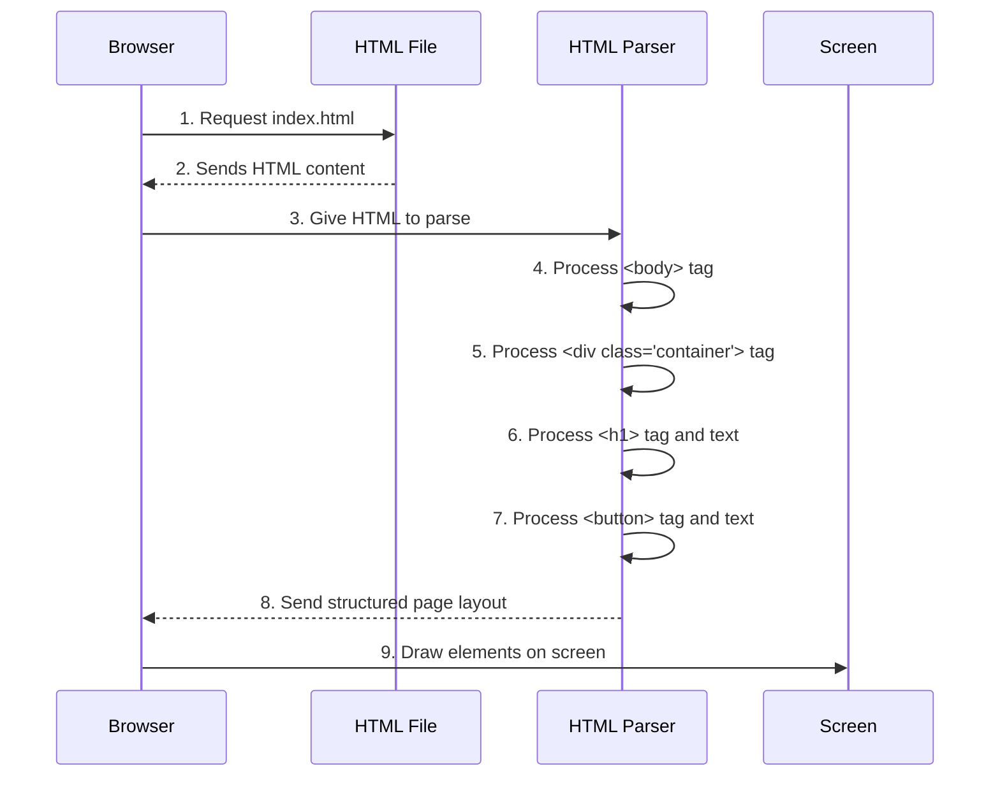

# Chapter 1: User Interface Structure

Welcome to the first step in understanding how our `Good-morning-` project works! Imagine you're building a house. Before you pick out paint colors or furniture, you need a blueprint – a plan that shows where the walls, rooms, and windows will go. This foundational plan is exactly what "User Interface Structure" is for a webpage.

### What is User Interface Structure?

At its core, User Interface Structure is about arranging things on a webpage. It's the **fundamental skeleton or blueprint** of what the user sees. It defines all the static elements like headings, text, and buttons, and where they are physically positioned on the page.

Think about our `Good-morning-` project. When you open it, you see a friendly message and a button. How do these things magically appear on your screen in specific places? That's the job of the User Interface Structure!

**The problem it solves:** How do we tell the web browser exactly what content to display and where to place it on the screen? We need a language for that!

### The Building Blocks: HTML

The language we use to create this structure is called **HTML** (HyperText Markup Language). HTML uses special "tags" to define different parts of your content. These tags tell the web browser what kind of element something is and how it should fit into the overall layout.

Let's look at the main file for our project, `index.html`. This file is like the architect's blueprint for our webpage.

```html
<!DOCTYPE html>
<html lang="en">
<head>
    <meta charset="UTF-8">
    <meta name="viewport" content="width=device-width, initial-scale=1.0">
    <title>Document</title>
</head>
<link rel="stylesheet" href="style.css">
<body>
    <div class="container">
        
    <h1><span id="updateContent"> HELLO MY DEAR FRIEND</span></h1>
    <button >touch me</button></div>
    <script src="hello.js"></script>
</body>
</html>
```

Don't worry about all the lines right now! We'll focus on the important parts for structure.

### Placing Elements on the Page

Our goal is to display the message "HELLO MY DEAR FRIEND" and a "touch me" button on the webpage. Let's see how `index.html` achieves this.

The most important part for visible content is inside the `<body>` tags. Everything you see on a webpage lives inside `<body>` and `</body>`.

```html
<body>
    <div class="container">
        
    <h1><span id="updateContent"> HELLO MY DEAR FRIEND</span></h1>
    <button >touch me</button></div>
    <!-- Other parts of the code are here, like <script> -->
</body>
```

Inside our `<body>`, we have a `<div class="container">`. A `<div>` is like a simple, invisible box. We use it to group other elements together, which can be useful for organizing or styling them later. Think of it like putting related items into one folder.

Inside this "container" box, we find the elements that create our user interface:

1.  **`<h1>` (Heading 1):**
    This tag is used for the most important heading on a page. The text "HELLO MY DEAR FRIEND" is placed inside `<h1>` and `</h1>`.
    ```html
    <h1><span id="updateContent"> HELLO MY DEAR FRIEND</span></h1>
    ```
    When your browser reads this, it knows to display "HELLO MY DEAR FRIEND" as a large, prominent heading. (The `<span id="updateContent">` part is for more advanced interactions, which we'll discuss in later chapters, so don't worry about it now!)

2.  **`<button>` (Button):**
    This tag creates a clickable button. The text "touch me" is placed between `<button>` and `</button>`.
    ```html
    <button >touch me</button>
    ```
    Your browser will render this as a button with "touch me" written on it.

So, by simply writing these HTML tags in `index.html`, we tell the browser: "First, show a big heading that says 'HELLO MY DEAR FRIEND', and right below it, show a button that says 'touch me'."

### How it Works Under the Hood

When you open `index.html` in your web browser, a series of steps happen to display the page:

1.  **Browser Reads HTML:** Your web browser (like Chrome, Firefox, or Edge) starts reading the `index.html` file from top to bottom.
2.  **HTML Parser:** It uses a special "HTML Parser" that understands what each HTML tag means.
3.  **Builds the Structure:** As the parser reads tags like `<body>`, `<div>`, `<h1>`, and `<button>`, it creates a "map" of the page's structure. It knows that the `<h1>` should come before the `<button>` because that's the order they appear in the HTML file.
4.  **Displays on Screen:** Finally, the browser uses this structure map to draw the elements on your screen, arranging them according to the HTML blueprint.

Here's a simplified sequence of how this happens:



**What the Browser Sees from `index.html`:**

Let's look at the specific lines in `index.html` that define our structure:

```html
<body>
    <div class="container">
        
    <h1><span id="updateContent"> HELLO MY DEAR FRIEND</span></h1>
    <button >touch me</button></div>
    <!-- ... other parts ... -->
</body>
```

*   `<body>...</body>`: This is the main content area. Everything between these tags will be visible on your webpage.
*   `<div class="container">...</div>`: This creates a generic block-level container. It doesn't have any special visual meaning on its own, but it's great for grouping related content. The `class="container"` is like giving this box a name so we can refer to it later (especially for styling, as we'll see in the next chapter!).
*   `<h1>...</h1>`: This defines a "Heading 1". The text inside it, "HELLO MY DEAR FRIEND", will appear as a large, bold title on the page. Headings are important for organizing content and for helping search engines understand your page.
*   `<button>...</button>`: This creates a clickable button. The text "touch me" is what will be displayed *on* the button.

These tags tell the browser exactly where to put the "HELLO MY DEAR FRIEND" message and the "touch me" button.

### Conclusion

In this chapter, we've learned that User Interface Structure is like the blueprint of our webpage. We use **HTML** and its special **tags** (like `<body>`, `<div>`, `<h1>`, and `<button>`) to define where our content goes. The browser then reads this blueprint and draws everything on the screen in the specified order.

You now understand how the "HELLO MY DEAR FRIEND" message and the "touch me" button get their basic shape and position on the page. But right now, they might look a bit plain. What if we want to change their color, size, or make them look more appealing? That's where styling comes in!

Let's move on to the next chapter to learn about making our interface beautiful: [Visual Styling and Presentation](02_visual_styling_and_presentation_.md).

---

<sub><sup>Generated by [AI Codebase Knowledge Builder](https://github.com/The-Pocket/Tutorial-Codebase-Knowledge).</sup></sub> <sub><sup>**References**: [[1]](https://github.com/Hemanth898/Good-morning-/blob/74ea66090adf038abdb46d11adf3788cf8776527/index.html)</sup></sub>
