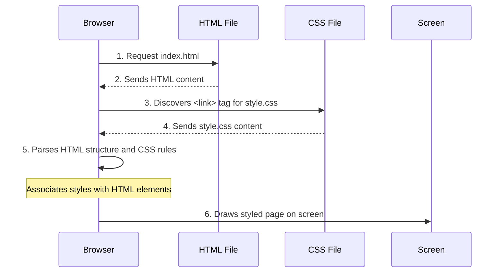

# Chapter 2: Visual Styling and Presentation

Welcome back! In [Chapter 1: User Interface Structure](01_user_interface_structure_.md), we learned how to build the basic "skeleton" of our webpage using HTML. We put the "HELLO MY DEAR FRIEND" message and the "touch me" button on the screen. But let's be honest, they looked a bit... plain. Like a house with just walls and no paint or furniture!

### What Problem Does Visual Styling Solve?

Imagine you've built your house, but the walls are bare, the furniture is just plain boxes, and there's no color anywhere. It works, but it's not inviting or pleasant to look at. This is the problem "Visual Styling and Presentation" solves for our webpage.

It's all about making your webpage beautiful and pleasant to use! This concept defines the **aesthetic appearance** of the webpage:
*   What colors are used?
*   What fonts make the text readable and appealing?
*   Where are elements placed (e.g., centered on the page)?
*   What background images set the mood?
*   How do elements react when you move your mouse over them (like a button changing color)?

Think of it like being an **interior designer** for your webpage. You choose the paint colors, the type of furniture, the curtains, and the overall ambiance, making the space visually appealing and comfortable without changing its structural foundation.

The central use case we're addressing here is: **How do we change the look and feel of our "Good-morning-" page, like adding a background image, changing text colors, or making the button look nicer?** We need a special language for that!

### The Style Guide: CSS

The language we use to apply visual styling is called **CSS** (Cascading Style Sheets). While HTML gives structure, CSS provides the style. It's a powerful tool that works hand-in-hand with HTML to bring your web pages to life.

In our project, all the styling instructions are kept in a file named `style.css`. Keeping CSS separate from HTML is a good practice, just like keeping your paint colors and furniture designs in a separate notebook from your house blueprints.

### Connecting CSS to HTML

Before we dive into the `style.css` file, how does our `index.html` know to use it? If you look back at `index.html` from the previous chapter, you'll see this important line inside the `<head>` section:

```html
<head>
    <!-- ... other meta tags ... -->
    <title>Document</title>
</head>
<link rel="stylesheet" href="style.css">
<body>
    <!-- ... visible content ... -->
</body>
```

The `<link rel="stylesheet" href="style.css">` line is like telling your browser: "Hey, go find the `style.css` file, because it contains all the visual instructions for this page!"

### How CSS Works: Selectors and Properties

CSS works by **selecting** an HTML element (or a group of elements) and then applying **style rules** to it.

A basic CSS rule looks like this:

```css
selector {
    property: value;
    property: value;
    /* More properties */
}
```

*   **`selector`**: This tells CSS *which* HTML element(s) to style. For example, `body` selects the entire body of the page, `.container` selects any element with `class="container"`, and `button` selects all buttons.
*   **`property`**: This is a specific visual aspect you want to change, like `color`, `font-size`, `background-image`, etc.
*   **`value`**: This is the setting for that property, like `red`, `20px`, `url(...)`, etc.

Let's see how `style.css` makes our `Good-morning-` page look vibrant!

### Styling Our Page: The `style.css` File

Here's how our `style.css` file brings the page to life, broken down into parts:

#### 1. Styling the Whole Page (`body`)

The `<body>` tag in HTML contains all the visible content. So, if we want to set a background image for the entire page, change the default text color, or center everything, we apply styles to the `body` selector.

```css
body{
    margin: 0;
    padding: 190px;
    font-family: Arial, sans-serif;
    display:flex; /* Helps arrange content */
    justify-content: center; /* Centers horizontally */
    align-items: center; /* Centers vertically */
    height: 100px; /* Adjusts height for centering */
    background-attachment: fixed;
    color:orchid; /* Default text color */
    background-image: url('https://images.unsplash.com/photo-1506744038136-46273834b3fb?auto=format&fit=crop&w=1500&q=80'); /* Morning image! */
    background-size: cover;
    background-repeat: no-repeat;
    background-position: center;
}
```

*   `margin: 0; padding: 190px;`: These control spacing around the content.
*   `font-family: Arial, sans-serif;`: Sets the default font for the text on the page.
*   `display: flex; justify-content: center; align-items: center; height: 100vh;`: These lines work together to take the content inside the `<body>` (our message and button) and **center it in the middle of the screen**, both horizontally and vertically. `height: 100vh;` means "take up 100% of the screen's height."
*   `color: orchid;`: Makes the default text color a lovely purple.
*   `background-image: url(...)`: This is where the magic happens! It sets a beautiful morning picture as the background of our entire page. `background-size: cover;`, `background-repeat: no-repeat;`, and `background-position: center;` make sure the image looks good and fills the whole screen without repeating.

#### 2. Styling the Container (`.container`)

Remember the `<div class="container">` from Chapter 1? We gave it a `class="container"` so we can specifically style it. The dot (`.`) before `container` in CSS means "select an element that has the class `container`."

```css
.container{
    text-align: center; /* Centers text inside this box */
}
```

This simply tells everything inside the `container` box (our `<h1>` and `<button>`) to be horizontally centered.

#### 3. Styling the Special Text (`span`)

Our "HELLO MY DEAR FRIEND" message actually has a `<span id="updateContent">` inside it. The `<span>` tag is useful for applying styles to just a small part of text *within* another element.

```css
span{
    color: rgb(19, 207, 53); /* A shade of green */
    font-size: 30px; /* Make it bigger! */
    font-weight: bold; /* Make it bold! */
}
```

Here, we're making the "HELLO MY DEAR FRIEND" text green, larger (30 pixels), and bold.

#### 4. Styling the Button (`button`)

Buttons are super important for interaction, and styling them makes them inviting to click!

```css
button{
    background-color: hotpink; /* Button's main color */
    color: whitesmoke; /* Text color on button */
    padding:0.3rem 1rem; /* Space inside the button */
    border: 2px solid honeydew; /* Border around button */
    border-radius: 5px; /* Makes corners slightly rounded */
    box-shadow: 0 0 5px 7px rgba(71, 8, 198, 0.912); /* A glowing shadow */
    cursor: pointer; /* Mouse changes to a hand when over button */
    font-size: 20px; /* Larger font for button text */
    font-weight: bold; /* Bold button text */
    transition: all 0.3s ease-in-out; /* Smooth changes when it's hovered */
    margin-top: 2px;
    margin-bottom: 2px;
}
```

This block applies many visual properties:
*   `background-color`: Fills the button with hotpink.
*   `color`: Sets the text "touch me" to whitesmoke.
*   `padding`: Adds space inside the button, making it larger and easier to click.
*   `border` and `border-radius`: Give the button a thin, light border with slightly rounded corners.
*   `box-shadow`: Creates a cool, glowing effect around the button.
*   `cursor: pointer;`: Changes your mouse cursor to a little hand icon when you hover over the button, indicating it's clickable.
*   `font-size` and `font-weight`: Make the "touch me" text bigger and bold.
*   `transition`: This is neat! It tells the browser that *any* change to the button's style should happen smoothly over 0.3 seconds, not instantly. This makes hover effects (coming next!) look much nicer.

#### 5. Styling the Button on Hover (`button:hover`)

What happens when you move your mouse *over* the button? We want it to change, right? This is where the `:hover` **pseudo-class** comes in. It lets you apply styles only when a user's mouse pointer is over the element.

```css
button:hover{
    background-color: rgb(19, 207, 53); /* Change to green on hover */
    color: black; /* Text becomes black on hover */
    border: 2px solid hotpink; /* Border changes to hotpink */
    box-shadow: 0 0 5px 7px rgba(71, 8, 198, 0.912) /* Keep the same shadow */
}
```

Now, when you hover your mouse over the "touch me" button, its background will smoothly change to green, its text will become black, and its border will turn hotpink! Thanks to the `transition` we added earlier, this change looks smooth and professional.

### How it Works Under the Hood

When you open `index.html` in your web browser, here's how CSS gets applied:

1.  **Browser Reads HTML:** Just like before, your web browser starts reading `index.html`.
2.  **Finds CSS Link:** When it encounters `<link rel="stylesheet" href="style.css">`, it knows it needs to load an external stylesheet.
3.  **Requests CSS File:** The browser sends another request to load `style.css`.
4.  **CSS Parser:** Once `style.css` is downloaded, the browser's "CSS Parser" reads through all the style rules.
5.  **Applies Styles:** For each HTML element (like `body`, `div`, `h1`, `span`, `button`), the browser checks if any CSS rules apply to it based on its tag name, class, or ID. If a rule applies, it updates the element's visual properties.
6.  **Renders Page:** Finally, the browser draws all the elements on the screen, but now with all the beautiful styles applied!

Here's a simplified sequence of how this happens:



**Key takeaways from `style.css`:**

*   `body`: Sets the overall background image, default text color, and uses `display: flex` properties to center the content on the page.
*   `.container`: Groups the heading and button, centering their text within their own area.
*   `span`: Specifically styles the "HELLO MY DEAR FRIEND" text to be green, bold, and larger.
*   `button`: Defines the button's appearance (hotpink background, whitesmoke text, rounded corners, shadow) and adds a smooth `transition` for hover effects.
*   `button:hover`: Specifies how the button changes its appearance when the mouse pointer is over it.

These CSS rules transform our plain HTML structure into a visually appealing web page!

### Conclusion

In this chapter, we've explored "Visual Styling and Presentation." We learned that **CSS** is the powerful language that acts as our interior designer, allowing us to control the colors, fonts, background images, and interactive effects like hover states. By linking `style.css` to `index.html`, we transformed our simple message and button into a vibrant and engaging part of our `Good-morning-` project.

You now understand how our page gets its inviting look! But what if we want to actually *do* something when we click that "touch me" button? That's what we'll explore in the next chapter: [User Input Mechanism](03_user_input_mechanism_.md).

---
