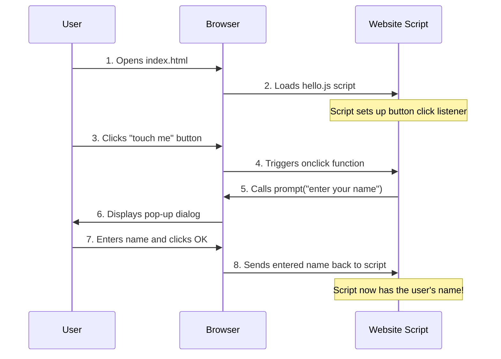

# Chapter 3: User Input Mechanism

Welcome back! In [Chapter 1: User Interface Structure](01_user_interface_structure_.md), we learned how to build the basic framework of our webpage with HTML. Then, in [Chapter 2: Visual Styling and Presentation](02_visual_styling_and_presentation_.md), we made it look beautiful using CSS. We have a friendly message and a great-looking button that changes color when you hover over it.

But right now, our "Good-morning-" page says "HELLO MY DEAR FRIEND" to everyone. What if we want it to be more personal? What if we want it to say "Good Morning, [YOUR NAME]"? For that, the website needs to **ask you for your name!**

### What Problem Does User Input Mechanism Solve?

Imagine you're talking to a new friend, and they want to know your name so they can address you personally. That's exactly what "User Input Mechanism" is for a website!

It's how a website **collects direct information from you**, the user. This information can then be used to personalize your experience, just like our `Good-morning-` project will use your name to greet you. Think of it as a brief, friendly questionnaire or a personal assistant asking for a specific piece of information from you directly.

The central use case we're addressing here is: **How can our `Good-morning-` page ask the user for their name using a simple pop-up?**

### Asking for Information: The `prompt()` Box

To get information directly from the user, web browsers offer a built-in feature called `prompt()`. When `prompt()` is used, it displays a small pop-up window (sometimes called a dialog box) on your screen. This pop-up does two things:

1.  It displays a message (like "What is your name?").
2.  It provides a text box where you can type your answer.

Once you type your answer and click "OK" (or press Enter), the `prompt()` function "captures" that information and gives it back to the website to use!

### Where Does the Magic Happen? The JavaScript File

The `prompt()` function isn't HTML or CSS. It's a piece of **JavaScript** code. JavaScript is the programming language that makes webpages interactive. It's what allows things to *happen* on a page, like responding to button clicks, changing text, or showing pop-ups.

In our project, all the JavaScript code is in a file named `hello.js`.

Just like we linked `style.css` in Chapter 2, we need to link `hello.js` to our `index.html` file so the browser knows about it. Look at the very end of our `<body>` section in `index.html`:

```html
<body>
    <div class="container">
        
    <h1><span id="updateContent"> HELLO MY DEAR FRIEND</span></h1>
    <button >touch me</button></div>
    <!-- This line links our JavaScript file! -->
    <script src="hello.js"></script>
</body>
```

The `<script src="hello.js"></script>` line tells the browser: "After you've loaded all the HTML and CSS, also load and run the code inside `hello.js`."

### Making the Button Interactive

We want the `prompt()` box to appear when the user clicks the "touch me" button. To do this, we need to tell our JavaScript code to "listen" for a click on that specific button.

Let's look at the `hello.js` file, piece by piece:

#### 1. Finding the Button and Message Area

First, our JavaScript needs to find the HTML elements it wants to interact with.

```javascript
// hello.js

// 1. Find the button in our HTML
const btn = document.querySelector('button');

// 2. Find the special text area (the HELLO MY DEAR FRIEND part)
const spans = document.getElementById('updateContent');
```

*   `document.querySelector('button');`: This line tells the browser: "Go into the `document` (which is our entire webpage) and `querySelector` (find) the first `<button>` you see." Once it finds the button, it stores a reference to it in a special box called `btn`. `const` means `btn` is a constant and won't change.
*   `document.getElementById('updateContent');`: This line is similar, but it looks for an HTML element that has a specific `id` called `updateContent`. Remember from Chapter 1 that our "HELLO MY DEAR FRIEND" text is wrapped in `<span id="updateContent">`. This line finds that specific `<span>` and stores a reference to it in the `spans` box. We'll use this later to *change* the text.

#### 2. Making Something Happen When the Button is Clicked

Now that we have a reference to the button, we can tell it what to do when it's clicked.

```javascript
// hello.js (continued)

// Tell the button: "When you are clicked, run this special function!"
btn.onclick = function () {
    // ... actions will go here ...
};
```

*   `btn.onclick = function () { ... };`: This is a very common way to respond to events. It says: "When the `btn` (our 'touch me' button) receives an `onclick` event (meaning someone clicks it), immediately run the code that's inside the curly braces `{}`."

#### 3. Showing the Pop-up and Getting the Name

Finally, inside that `function`, we use `prompt()` to ask for the name.

```javascript
// hello.js (continued)

btn.onclick = function () {
    // Show a pop-up asking for the user's name
    const name = prompt('enter your name');

    // For example, if you type "Alice" and click OK:
    // The 'name' variable will now hold the text "Alice".
};
```

*   `prompt('enter your name');`: This is the core of our input mechanism! When this line runs, the browser displays a small pop-up on the screen. The text "enter your name" will be displayed in the pop-up, asking the user for input.
*   `const name = ...;`: Whatever the user types into the pop-up's text box and confirms (by clicking "OK" or pressing Enter) is then *returned* by the `prompt()` function. This returned text is then immediately stored in a new box called `name`. Now, our JavaScript knows the user's name!

### How it Works Under the Hood

When you open `index.html` and click the "touch me" button, here's the sequence of events that leads to the pop-up:

1.  **Page Loads:** The browser reads `index.html`, including the `<script src="hello.js"></script>` line. It loads `hello.js`.
2.  **Script Initializes:** The `hello.js` script runs, finding the button and the `<span>` element, and setting up the `onclick` event listener on the button. It's now "listening" for a click.
3.  **User Clicks Button:** You click the "touch me" button on the screen.
4.  **Browser Detects Click:** The browser immediately notices that the `btn` element (which it knows about from `hello.js`) has been clicked.
5.  **Browser Runs `onclick` Function:** Because `btn.onclick` was set up, the browser executes the JavaScript function associated with that `onclick` event.
6.  **`prompt()` is Called:** Inside that function, the `prompt('enter your name');` line is executed.
7.  **Pop-up Appears:** The browser then displays the `prompt()` dialog box on your screen with the message "enter your name" and a text input field.
8.  **User Enters Name:** You type your name (e.g., "Alice") into the pop-up and click "OK".
9.  **Name is Captured:** The `prompt()` function finishes, and it returns the text "Alice". This text is then stored in the `name` variable in your JavaScript code.

Here's a simplified diagram of this interaction:



**Key takeaways about `hello.js` for User Input:**

*   **`document.querySelector()` and `document.getElementById()`:** These are how JavaScript "finds" specific parts of your HTML page.
*   **`.onclick = function() { ... };`:** This is how JavaScript makes something happen when an HTML element (like our button) is clicked.
*   **`prompt('message');`:** This is the special function that creates a pop-up box, asks the user a question, and captures whatever text the user types in.

Now you understand how our website can ask for and receive information directly from you! But what good is getting the name if we don't use it? In the next chapter, we'll learn how to take that captured name and display it on the page, changing "HELLO MY DEAR FRIEND" to a personalized greeting!

Let's move on to the next chapter to learn about making our interface truly dynamic: [Client-Side Interaction Logic](04_client_side_interaction_logic_.md).

---
