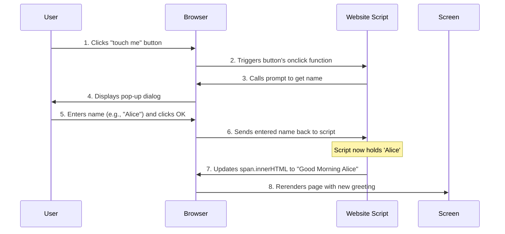

# Chapter 4: Client-Side Interaction Logic

Welcome back! In [Chapter 1: User Interface Structure](01_user_interface_structure_.md), we built our basic webpage. In [Chapter 2: Visual Styling and Presentation](02_visual_styling_and_presentation_.md), we made it look beautiful. And in [Chapter 3: User Input Mechanism](03_user_input_mechanism_.md), we learned how our website can ask you for your name using a `prompt()` pop-up.

Now, we have your name! But what good is asking for it if the page still just says "HELLO MY DEAR FRIEND"? This is where "Client-Side Interaction Logic" comes in.

### What Problem Does Client-Side Interaction Logic Solve?

Imagine you walk into a fancy hotel, and a friendly receptionist greets you. They ask for your name (that was our `prompt()` from Chapter 3!). Now, once they have your name, they don't just stand there; they immediately customize their next words, perhaps saying, "Welcome, Mr. Smith, your room is ready."

"Client-Side Interaction Logic" is the "brain" of your webpage. It's what allows the webpage to:
*   **Listen** for user actions (like clicking a button).
*   **Process** any information it receives (like your name).
*   **Execute** specific tasks in response, making the page dynamic and personalized.

It's the part that says: "Aha! The user just clicked that button, AND they typed 'Alice' into the pop-up. Now I need to *change* the greeting on the screen to 'Good Morning Alice'!"

**The central use case we're addressing here is:** How can our `Good-morning-` page take the name provided by the user and dynamically update the greeting message on the page?

### The Brain of the Webpage: JavaScript in Action

As we briefly touched on in Chapter 3, **JavaScript** is the programming language that gives our webpage its intelligence and interactivity. It's the engine that makes things happen.

All the logic for our `Good-morning-` project lives in the `hello.js` file, which is linked to our `index.html` file right before the `</body>` tag:

```html
<body>
    <!-- ... our message and button ... -->
    <script src="hello.js"></script>
</body>
```

This ensures that our JavaScript code is loaded and ready to act once the HTML structure and CSS styles are in place.

### How Our Logic Works: Step-by-Step

Let's look at the `hello.js` file again, focusing on the lines that make our page truly interactive.

```javascript
// hello.js

// 1. Find the button in our HTML (recap from C3)
const btn = document.querySelector('button');

// 2. Find the special text area (the HELLO MY DEAR FRIEND part) (recap from C3)
const spans = document.getElementById('updateContent');

// 3. Tell the button: "When you are clicked, run this special function!"
btn.onclick = function () {
    // 4. Show a pop-up asking for the user's name (recap from C3)
    const name = prompt('enter your name');

    // 5. THIS IS THE NEW LOGIC: Update the greeting message!
    spans.innerHTML = `Good Morning ${name}`;
};
```

Let's break down the important lines for "Client-Side Interaction Logic":

#### 1. Listening for the Action (`btn.onclick`)

```javascript
btn.onclick = function () {
    // ... actions will go here ...
};
```
As explained in [Chapter 3: User Input Mechanism](03_user_input_mechanism_.md), this line is an **event listener**. It's like an ear that's constantly listening for a specific "event" on the `btn` (our "touch me" button). The event it's listening for is a `click`.

When a click happens, the JavaScript code inside the `function() { ... }` curly braces is immediately executed. This function is where all our interaction logic resides.

#### 2. Getting the Input (`const name = prompt(...)`)

```javascript
const name = prompt('enter your name');
```
This line, also covered in [Chapter 3: User Input Mechanism](03_user_input_mechanism_.md), is how our program *receives* input from you. When `prompt()` runs, it shows a pop-up, and whatever you type into that pop-up (e.g., "Alice") gets stored in a variable called `name`. Now our logic has the personalized data it needs!

#### 3. Changing the Page Content (`spans.innerHTML = ...`)

This is the core of our "Client-Side Interaction Logic" for this chapter!

```javascript
spans.innerHTML = `Good Morning ${name}`;
```

Let's break this down:

*   **`spans`**: Remember from Chapter 1 and Chapter 3, `spans` is our JavaScript's way of referring to the `<span id="updateContent"> HELLO MY DEAR FRIEND</span>` part of our HTML.
*   **`.innerHTML`**: This is a special property that allows JavaScript to *get* or *set* the HTML content (including text) *inside* an HTML element. When you *set* it (using the `=` sign), you are telling the browser to replace whatever was inside that HTML element with your new content.
*   **`` `Good Morning ${name}` ``**: This is a new type of string in JavaScript called a **template literal**. Notice the backticks (`` ` ``) instead of regular quotes (`'` or `"`).
    *   Template literals are super handy because they let you embed variables directly inside the text using `${}`.
    *   So, if `name` holds "Alice", then `` `Good Morning ${name}` `` becomes "Good Morning Alice". If `name` holds "Charlie", it becomes "Good Morning Charlie".

**In simple terms:** This line tells the browser: "Find the `<span>` element, and change its entire content to `Good Morning` followed by whatever the user typed for their name!"

### How It All Works Under the Hood

Let's put it all together to see the sequence of events when you interact with the `Good-morning-` page:

1.  **Page Loads:** Your browser loads `index.html`, including `style.css` (for styling) and `hello.js` (for logic).
2.  **Script Initialization:** `hello.js` runs once, finding the `btn` and `spans` elements and setting up the `onclick` listener for the button. The "brain" is now waiting for a signal.
3.  **User Clicks "touch me":** You click the button. This is the signal.
4.  **Logic Triggered:** The `btn.onclick` listener activates, and the JavaScript function inside it begins to run.
5.  **Ask for Name:** The `prompt('enter your name');` line executes, and a pop-up appears.
6.  **User Provides Name:** You type your name (e.g., "Alice") and click "OK". The `name` variable now holds "Alice".
7.  **Process and Update:** The JavaScript logic continues to the next line: `spans.innerHTML = `Good Morning ${name}`;`.
    *   It takes the `name` ("Alice").
    *   It creates the new greeting: "Good Morning Alice".
    *   It then commands the browser to update the content of the `<span>` element.
8.  **Display Changes:** The browser, following JavaScript's instruction, immediately removes "HELLO MY DEAR FRIEND" from the screen and displays "Good Morning Alice" in its place.

Here's a simplified sequence diagram:



This entire process, from listening for your click, to asking for your name, to using that name to change the display, is what "Client-Side Interaction Logic" is all about!

### Conclusion

In this chapter, we've brought our `Good-morning-` project to life! We learned that "Client-Side Interaction Logic" is the brain of our webpage, enabling it to respond to user actions and dynamically change its content. By combining the `onclick` event listener, the `prompt()` input mechanism, and the powerful `innerHTML` property, our JavaScript code now personalizes the greeting message.

You now understand how the page reacts to your input and changes what you see. But what if we want to do even more with that dynamic content, like showing different messages or elements based on different conditions? That's what we'll explore next!

Let's move on to the final chapter to learn about making our interface truly dynamic: [Dynamic Content Display](05_dynamic_content_display_.md).

---
