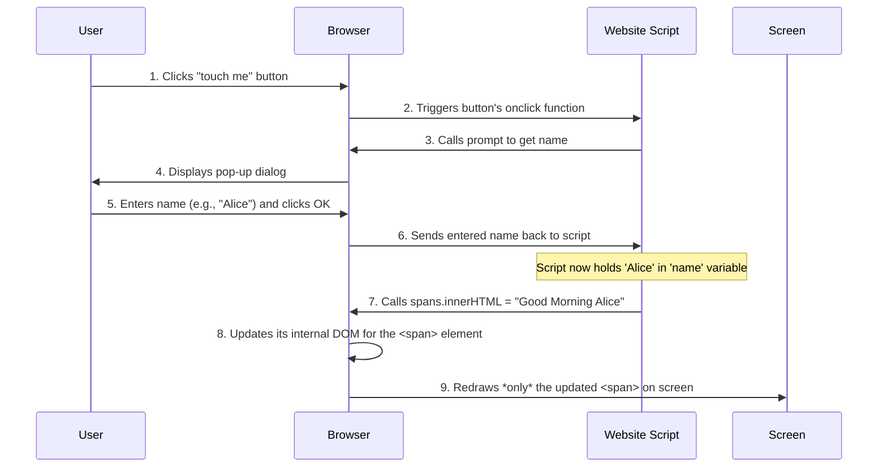

# Chapter 5: Dynamic Content Display

Welcome to the final chapter of our `Good-morning-` project tutorial! In [Chapter 4: Client-Side Interaction Logic](04_client_side_interaction_logic_.md), we learned how our website's "brain" (JavaScript) listens for your clicks, asks for your name using a `prompt()` pop-up, and prepares a personalized greeting.

But there's one crucial piece of magic left: How does the "HELLO MY DEAR FRIEND" message on the screen *actually change* to "Good Morning [Your Name]" right before your eyes, without the whole page blinking or reloading? This is the power of "Dynamic Content Display."

### What Problem Does Dynamic Content Display Solve?

Imagine you're at a modern airport, looking at a large digital display board that shows flight information. When a flight's status changes (e.g., from "On Time" to "Delayed"), the text for that specific flight updates instantly. The *entire board* doesn't disappear and then redraw itself just for that one change. It's smooth and efficient.

"Dynamic Content Display" is exactly like that for our webpage. It's the ability to **update specific parts of the webpage's text or content *after* the page has initially loaded, without requiring the entire page to refresh.** This makes the user experience much smoother and more responsive, as changes happen instantly.

The central use case we're addressing here is: **How does our `Good-morning-` page take the name provided by the user and instantly change the visible greeting message on the screen, without reloading the whole page?**

### The Webpage's Internal Map: The DOM

To understand how content changes dynamically, we need to know how the browser organizes what it sees. When your browser loads an HTML page, it builds an internal "map" or "tree" of all the elements on that page. This map is called the **DOM** (Document Object Model).

Think of the DOM as a detailed blueprint that the browser creates from your HTML. It knows:
*   There's a `<body>`.
*   Inside the `<body>` is a `<div>` with the class `container`.
*   Inside that `<div>` is an `<h1>` heading.
*   And inside the `<h1>`, there's a `<span>` element with the `id="updateContent"` that contains the text "HELLO MY DEAR FRIEND".

When we want to change something on the page dynamically, our JavaScript code doesn't directly rewrite the `index.html` file. Instead, it tells the browser: "Hey, go into your internal DOM map, find that specific `<span>` element, and change its text!" The browser then updates its internal map and re-draws *only* the changed part on your screen.

### How We Do It: The `innerHTML` Property

In [Chapter 4: Client-Side Interaction Logic](04_client_side_interaction_logic_.md), we saw this key line in our `hello.js` file:

```javascript
// hello.js

// ... (previous code to find button and spans) ...

btn.onclick = function () {
    const name = prompt('enter your name'); // Get the user's name

    // THIS IS THE LINE FOR DYNAMIC CONTENT DISPLAY!
    spans.innerHTML = `Good Morning ${name}`;
};
```

Let's break down `spans.innerHTML = `Good Morning ${name}`;` one more time, focusing on how it achieves dynamic display:

1.  **`spans`**: As we learned, this is our JavaScript's way of referring to the specific HTML element we want to change: `<span id="updateContent"> HELLO MY DEAR FRIEND</span>`. We found this element using `document.getElementById('updateContent')`.
2.  **`.innerHTML`**: This is a special tool in JavaScript that lets us control the content *inside* an HTML element.
    *   When you use `spans.innerHTML = "something new";`, you are telling the browser: "Take whatever text and HTML was *inside* the `spans` element, and completely replace it with 'something new'."
3.  **`` `Good Morning ${name}` ``**: This is the new content we want to put inside the `<span>`.
    *   The backticks (`` ` ``) create a **template literal**, which is a powerful way to build strings.
    *   The `${name}` part is a **placeholder** that gets replaced by the actual value stored in the `name` variable (e.g., "Alice"). So, if `name` is "Alice", this entire part becomes the string "Good Morning Alice".

**Putting it together:** The line `spans.innerHTML = `Good Morning ${name}`;` means: "Find the HTML element that our `spans` variable points to, and change its inner content to a personalized 'Good Morning' message, based on the name the user typed."

Because JavaScript is working directly with the browser's internal DOM, the change happens almost instantaneously.

### How It Works Under the Hood

Let's trace the steps for dynamic content display when you interact with the page:



**What's important here:**
*   **Step 8:** The browser doesn't reload the entire HTML file. It just updates its internal "map" of the page.
*   **Step 9:** The browser is smart enough to then only redraw the small part of the screen that has changed, making the update appear instant and seamless to you, the user.

This is the essence of "Dynamic Content Display" – the ability to modify the live webpage content in real-time, making your web applications feel responsive and interactive without disruptive full page refreshes. It's fundamental to modern web experiences!

### Conclusion

In this chapter, we've explored "Dynamic Content Display." We learned that it's the ability for a webpage to update specific text or elements instantly, without needing to reload the entire page. This is achieved by JavaScript directly modifying the browser's internal "map" of the page, called the **DOM**, using properties like `innerHTML`.

You now understand how our `Good-morning-` project smoothly changes its greeting from "HELLO MY DEAR FRIEND" to a personalized message, making the page feel alive and responsive. You've seen how the interface is structured, styled, takes input, and dynamically responds to it!

---

<sub><sup>Generated by [AI Codebase Knowledge Builder](https://github.com/The-Pocket/Tutorial-Codebase-Knowledge).</sup></sub> <sub><sup>**References**: [[1]](https://github.com/Hemanth898/Good-morning-/blob/74ea66090adf038abdb46d11adf3788cf8776527/hello.js), [[2]](https://github.com/Hemanth898/Good-morning-/blob/74ea66090adf038abdb46d11adf3788cf8776527/index.html)</sup></sub>
