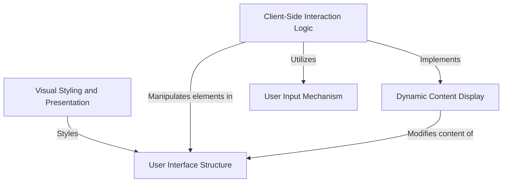

# Tutorial: Good-morning-

This simple web project creates a *friendly interactive greeting*. It starts by displaying a general 'Hello' message, then allows you to **enter your name** through a pop-up. Once you provide your name, the page dynamically *updates the greeting* to specifically welcome you. The entire experience is visually appealing thanks to custom styling.

## Visual Overview

## Chapters

1. [User Interface Structure
](01_user_interface_structure_.md)
2. [Visual Styling and Presentation
](02_visual_styling_and_presentation_.md)
3. [User Input Mechanism
](03_user_input_mechanism_.md)
4. [Client-Side Interaction Logic
](04_client_side_interaction_logic_.md)
5. [Dynamic Content Display
](05_dynamic_content_display_.md)

---

Generated by [AI Codebase Knowledge Builder](https://github.com/The-Pocket/Tutorial-Codebase-Knowledge).
